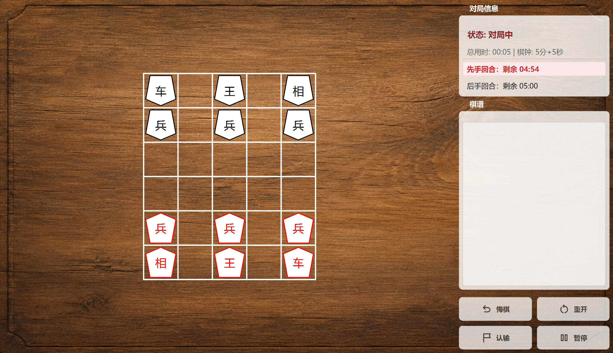
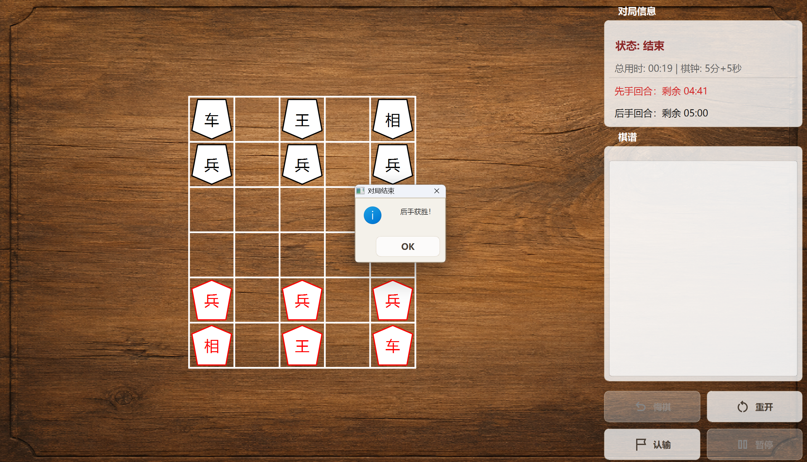

# MShogi（混合将棋）

[English](README.md) | **简体中文**

MShogi 是一款使用 C++17 与 Qt 6 开发的双人桌面棋类游戏。它采用 5 列 × 6 行棋盘，融合王、车、相、兵、侯的移动规则，以及吃子后重新打入、兵升变、下底胜利等机制。

## 功能

- 完整盘面与轮次管理，先手位于下方并先行。
- 整合式开局设置与奇偶猜先，可设置玩家名称、棋钟和每步奖励。
- 支持双人和人机模式；内置后台运行的 Alpha-Beta 基线 AI，可选择搜索深度。
- 车的长距离空格移动与纵向两格突击、相的隔子吃子、兵到底线升变为侯。
- 手驹按具体棋子记录禁手回合，支持合法位置提示与拖拽打入。
- 棋谱、悔棋、重开、认输、暂停与继续。
- 双方棋钟、每步奖励时间、总对局用时与超时判负。
- 支持吃王、下底、无合法着法、超时和认输等明确结束原因。
- Qt Graphics View 可缩放界面、QSS、图标与音效资源。
- Google Test 覆盖棋盘、规则、引擎及 UI 拖拽。

详细规则见项目管理根目录的 MShogi_Rule.md。

## 开发环境

项目当前基准环境：

- Qt 6.8.3：Core、Gui、Widgets、Multimedia、Test
- MinGW 13.1.0
- CMake 4.3.2
- Ninja
- C++17

CMake 要求 Qt 6.8 或更高的 6.x 版本。Google Test 1.14.0 从仓库内的压缩包离线加载。

## 项目结构

- include/：公开头文件、无界面 GameCore 与 AI 接口。
- src/：规则核心、Alpha-Beta 代理、引擎、棋钟、场景、控件和程序入口。
- tests/：Google Test 与 Qt Test 回归测试。
- res/、resources.qrc：样式、棋盘背景、按钮图标和音效。
- assets/：README 展示图片。

在完整管理工作区中，源码位于 ./Src/Mixed-Shogi/，所有构建产物写入 ./Src/Build/。

## 编译与测试

在完整管理工作区根目录执行：

    cmake -S ./Src/Mixed-Shogi -B ./Src/Build/MinGW_13_1_0-Debug -G Ninja -DCMAKE_BUILD_TYPE=Debug -DCMAKE_PREFIX_PATH=D:/Apps_D/Qt/6.8.3/mingw_64
    cmake --build ./Src/Build/MinGW_13_1_0-Debug --parallel
    ctest --test-dir ./Src/Build/MinGW_13_1_0-Debug --output-on-failure

如将此仓库单独克隆，可将构建目录改为仓库外或被 .gitignore 忽略的 build/：

    cmake -S . -B build -G Ninja -DCMAKE_PREFIX_PATH=D:/Apps_D/Qt/6.8.3/mingw_64
    cmake --build build --parallel
    ctest --test-dir build --output-on-failure

程序目标为 MShogiApp，测试目标为 MShogiTests。发布构建时可使用 -DCMAKE_BUILD_TYPE=Release -DBUILD_TESTING=OFF。

训练或自博弈服务器可在不安装 Qt 的情况下只构建无界面核心：

    cmake -S . -B build-headless -G Ninja -DMSHOGI_BUILD_APP=OFF -DBUILD_TESTING=OFF
    cmake --build build-headless --parallel

## 许可证

项目采用 [GNU GPL v3](LICENSE)。

## 界面预览

