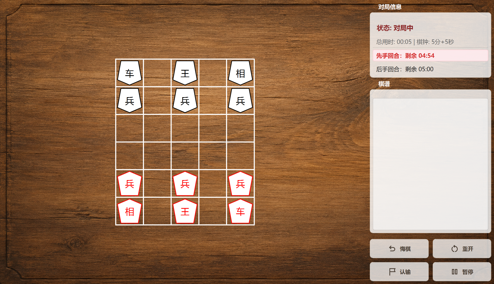
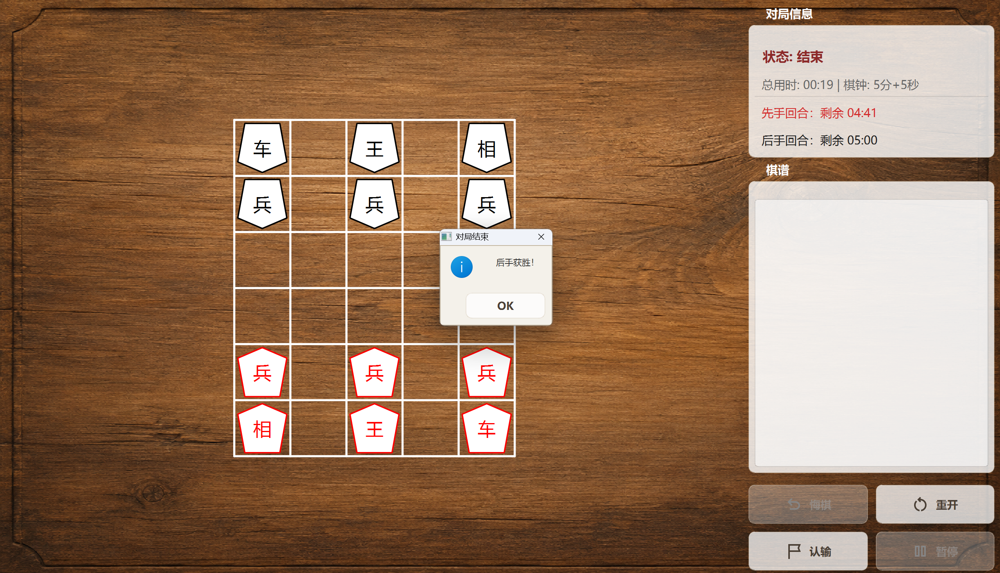

# MShogi

**English** | [简体中文](README-CN.md)

MShogi is a cross-platform desktop Japanese Chess (Shogi) application built with C++ and Qt. It features a complete rules engine, a beautiful wood-textured UI, and various game tools designed for an immersive Shogi experience.

## 📸 Screenshots

## ✨ Features

* [cite_start]**Complete Rule Engine**: Accurately implements Shogi rules, including piece movements and state management.
* [cite_start]**Interactive UI**: Supports explicit mouse movements (drag and drop) and displays legal moves (highlighting) for the selected piece.
* [cite_start]**Game History & Notation**: Real-time recording of the game history/log for easy review and analysis.
* **Match Clock**: Fully functional dual-timer system (Sente/Gote) with customizable total time and increment settings.
* [cite_start]**Game Controls**: Supports Pause/Resume, Undo, Resign, and Resetting the board.
* **High-DPI Support**: Automatically scales and renders crisp text and vector graphics on modern high-resolution displays.

## 🛠️ Build Instructions

### Prerequisites

* **C++ Compiler**: GCC, Clang, or MSVC (C++17 or later recommended).
* **Qt Framework**: Qt 5.12+ (requires `Widgets` and `Gui` modules).
* **Build Tool**: CMake or qmake.
* **Nix** (optional): A [Nix flake](https://nixos.wiki/wiki/Flakes) is provided for a reproducible development environment with all dependencies pre-configured.

### Compilation Steps (using Qt Creator)

1. Clone the repository: `git clone https://github.com/QWERTY-HRZ/MShogi.git`
2. Choose the .pro (qmake) or CMakeLists.txt (CMake) file in the repository.
3. Open Qt Creator and select File -> Open File or Project....
4. Configure the project with your installed Qt kit.
5. Click Build (or press Ctrl+B) and Run (or press Ctrl+R).

### Development with Nix Flake

If you have [Nix](https://nixos.org/) with [flakes](https://nixos.wiki/wiki/Flakes) enabled:

1. Enter the development shell: `nix develop` (or run `direnv allow` if you use [direnv](https://direnv.net/)).
2. Build the project with CMake as usual — all Qt dependencies are provided by the flake.
